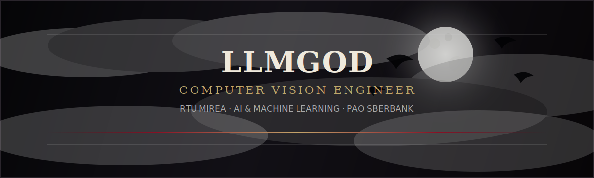

<div align="center">



<br>

`☾ neural networks in the moonlight · computer vision in the dark · clean code under pressure ☽`

<br><br>

[](https://git.io/typing-svg)

</div>


## `†` About Me

```txt
alias       llmgod
path        artificial intelligence / machine learning / computer vision
university  RTU MIREA
internship  PAO Sberbank — Computer Vision Engineer
foundation  Software Development diploma
```

> I study **Artificial Intelligence and Machine Learning** at **RTU MIREA** and work with the darker machinery of perception: pixels, features, models, metrics, and systems that learn to see.

- `01` Computer Vision Engineer Intern at **PAO Sberbank**
- `02` AI & ML student at **RTU MIREA**
- `03` Software Development diploma from a Computer Academy
- `04` Interested in **computer vision**, **deep learning**, **backend systems**, and **ML infrastructure**
- `05` Building projects where models do not stay in notebooks, but become working tools


## `☩` Tech Grimoire

<div align="center">


</div>

```txt
vision      OpenCV · PyTorch · image processing · model evaluation
backend     Python · FastAPI · Django · PostgreSQL
systems     Docker · Linux · Git · automation
learning    ML experiments · datasets · metrics · reproducibility
```


## `☾` Current Focus

<table>
  <tr>
    <td width="50%">
      <h3>Computer Vision</h3>
      <p>Detection, classification, preprocessing, evaluation, and production-minded ML pipelines.</p>
    </td>
    <td width="50%">
      <h3>Machine Learning</h3>
      <p>Training loops, experiments, metrics, model behavior, and practical AI systems.</p>
    </td>
  </tr>
  <tr>
    <td width="50%">
      <h3>Software Development</h3>
      <p>APIs, services, databases, automation, and code that survives outside the lab.</p>
    </td>
    <td width="50%">
      <h3>Academic Path</h3>
      <p>AI & ML at RTU MIREA, strengthened by a Software Development diploma.</p>
    </td>
  </tr>
</table>


## `♱` GitHub Relics

<div align="center">


</div>


<div align="center">

## `✉` Summon Me

[](https://t.me/nightmode)
[](mailto:talent@rambler.ru)

<br><br>

```txt
              software is a ritual:
              observe → model → test → deploy
```


</div>
